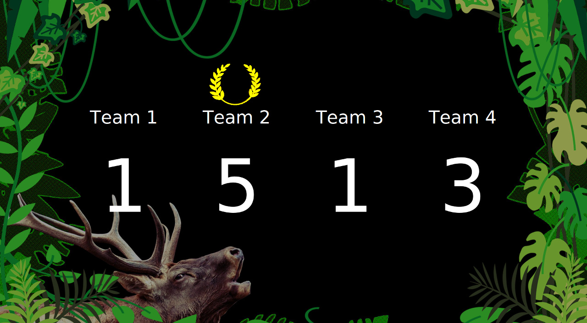
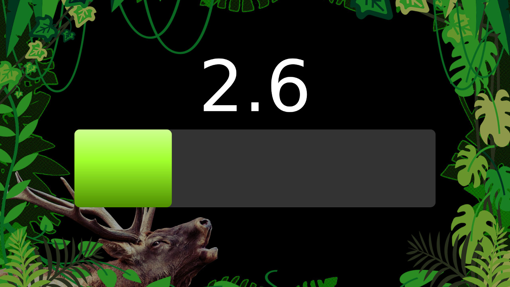

# WaveBuzzer
Keep score of up to 4 teams. Has "stag-on-heat" sounds and an adjustable timer that can be started/stopped by joysticks.
 
 

License
========

[BSD-2-Clause](http://opensource.org/licenses/BSD-2-Clause), see LICENSE.md

Building
========

**Use CMake:**
<pre>
cd WaveBuzzer
cmake .
make
</pre>
Visual Studio 2015, G++ 5.4 or Clang 3.9 (C++11 support) are needed. For installing a new G++ version see [here](http://lektiondestages.blogspot.de/2013/05/installing-and-switching-gccg-versions.html). Qt >= 5.3 is needed, especially its multimedia multimedia modules.

Keys
========
**Software**
ALT+F4 - Exit
F11 - Toggle window/full-screen.

**Teams and scores**
F1 - Show/hide team 1.  
F2 - Show/hide team 2.  
F3 - Show/hide team 3.  
F4 - Show/hide team 4.  
0 - Clear all scores to 0.  
1 - Increase score of team 1 (hold Shift to decrease).  
2 - Increase score of team 2 (hold Shift to decrease).  
3 - Increase score of team 3 (hold Shift to decrease).  
4 - Increase score of team 4 (hold Shift to decrease).  
 * Left-click team name to edit. Editing stops when pressing return or clicking out of the team name edit field.  
 * The laurel marks the team with the highes score. Only scores from visible teams are taken into account.  

**Timer**
Space or joystick button - Start/stop timer.  
 * Right-click onto the window to select the joystick used or adjust the timer.  

**Gimmicks**
H - Stag sound #1.  
J - Stag sound #2.  
K - Stag sound #3.  
